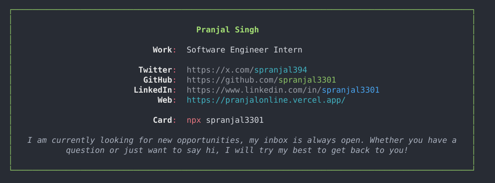

# 🏆  CLI portfolio

Basically a terminal based portfolio. (for nerds 🤓).

## 👨‍💻 Run my business card

### Node
```bash
npx spranjal3301
```

### Yarn
```bash
yarn dlx spranjal3301
```

### PnPm
```bash
pnpm dlx spranjal3301
```

### Bun
```bash
bunx spranjal3301
```

If you wish to reuse it, you can easily update the links in the `personal-info.json` file (the script will read from there 😄).

If you edit the script on your machine, you will have to run `npm link` to locally _symlink_ the package, and then run `card` in your terminal.

## 👨‍🍳 The Coder

Me, I'm **[Pranjal Singh](https://pranjalonline.vercel.app/)**, a programmatic and passionate software developer who enjoys challenges and continuous learning on a daily basis! 👨‍🏭


<div align="center">



</div>

## 👀 Heavily inspired by ...

This script was heavily inspired by [@natterstefan](https://github.com/natterstefan)'s NPM business card package.
